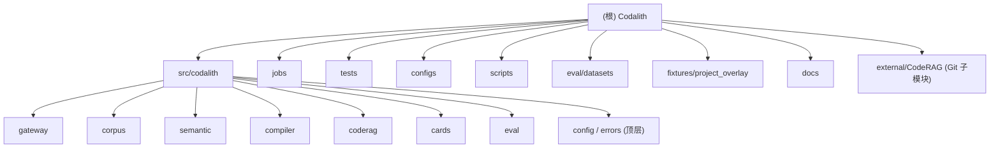

# Codalith — AI 上下文索引（根级）

> 本文件由 AI 上下文初始化流程生成，2026-07-01 21:12:11。
> 本仓库当前只维护这一份根级 CLAUDE.md；模块细节以各模块源码与本文件的模块索引为准。

## 变更记录 (Changelog)

| 时间 | 动作 | 说明 |
| --- | --- | --- |
| 2026-07-08 | 内核收口 + 数据迁移 | 去 UE 硬编码扫尾：coderag adapter 的模块识别/忽略目录/文件后缀改语料级配置（`Corpus.module_roots`/`index_ignore_dirs`/`index_suffixes`，`module_from_path` 参数化）；semantic store 表/索引 `ue_*` 改名 `codalith_*` 且 `initialize_schema` 内置 SQLite/Postgres 启动自动迁移（旧表改名、`ue_version` 列改 `version`，数据保留）；writers `upsert_module_dep` 的 extractor/observed_from 参数化，graph reflection kinds 改查库数据驱动；auth 默认 scopes 从 registry 的 `access_scopes` 派生（删除硬编码 `ue:5.7`，`CODALITH_SCOPES` 仍可覆盖）；compiler 重排改宽窗口后分流——卡片命中只进 `cards`（验证过的 evidence span 仍附加），`source_spans` 只留源码，修复卡片挤占召回导致的指标回退；compose `mcp-http` 按建索引布局挂载 indexed_root（Engine/Source + Engine/Plugins + `data/cards` 持久化 KNOWLEDGE，新增 `CODALITH_ENGINE_PLUGINS_HOST_ROOT`）。生产 Postgres 已完成自动迁移，seed 卡已重生成并重建索引（旧 `UE_KNOWLEDGE` chunk 已清理），本地 runner 与 MCP runner 双 eval 80/80 全 pass（recall/module_accuracy 全 1.0）。同时清理本文件中指向从未落盘的模块级 CLAUDE.md 的失效链接。 |
| 2026-07-07 | 去 UE 硬编码改造 | 中性内核 + 配置驱动能力声明落地：`ue_version` 字段/DB 列改名 `version`（`version_label` 属性兜底 corpus_id）；`ue://`/`ue-project://`/`ue-generated://` 三 scheme 合并为 `codalith://<corpus_id>/<facet>/...`（共享 helper `corpus/uris.py`，ContextPack `schema_version` 0.2 新增顶层 `corpus_id` 与 span `corpus_kind`，`wrong_version_rate` 改按 corpus 一致性判定）；module hints/identifier stopwords 外置 `configs/source_priors.json`，seed 卡外置 `configs/seed_cards.json`，scope 路径前缀改语料级 `scope_prefixes` 配置，`UE_KNOWLEDGE` 目录改中性常量 `CARDS_DIR`（`KNOWLEDGE`）；UE 语义提取收口 `semantic/extractors/unreal.py` profile（registry 配置 `semantic_profile: "unreal"`，`jobs/extract_semantic.py` 变中性驱动器）；marker `ue_acceptance`→`corpus_acceptance`、compose 服务 `ue-acceptance`→`corpus-acceptance`（profile `acceptance`）、jobs/eval CLI `--version` 默认 None 由 registry 默认引擎推导。本地 semantic DB 与 seed 卡需重新生成，MCP 服务需重启。 |
| 2026-07-07 | 能力声明配置化 | MCP 客户端可见的自描述不再硬编码 UE5：`Corpus` 新增 `display_name`/`description`/`keywords`（`configs/corpus_registry.json` + `.env` 可覆盖），`initialize.instructions` 由 `build_instructions(registry)` 运行时组装，工具 schema 描述中性化且 `version` 默认值从 registry 默认引擎派生（工具方法 `version` 参数改为 `None` 跟随配置）；resources 名称改用 corpus label；ContextPack summary/caveats/reason 及 `source-locator` 标签去 UE 措辞。`ue://` scheme、`ue_version` 字段、semantic extractors、source priors 等域适配层保持不变。 |
| 2026-07-07 | 检索内核优化 | 新增共享文本原语模块 `codalith/text.py`（normalize/tokenize/contains_word/camel_words），intent/entity/source_locator/local 检索四处 tokenize 统一；reranker 改为按 source 分组归一化 base 分并移除 prior `+1000` 哨兵值；local fallback `_local_search` 由每查询全量扫描改为窗口级倒排索引（含 CamelCase/snake_case 子词展开）。 |
| 2026-07-07 | 数据集合并 | `ue50.jsonl` + `ue57_common_issues_30.jsonl` 物理合并为 `eval/datasets/ue_eval_suite.jsonl`（80 题，全部带 `version`），判定口径统一为 80/80 全 `pass`；benchmark 测试改名 `test_ue_eval_suite_benchmark.py`，seed/数据集 fixture 上移至 `tests/conftest.py`。 |
| 2026-07-07 | 全面优化修复 | gateway 安全修复（工具白名单、限流先于读取、session 上限）、compiler/coderag 词边界与 URI 修复、semantic 事务/UHT 解析/schema 修复、cards 先验证后发布、eval 指标口径统一并提取 `eval/common.py`；删除死代码（gateway/errors.py、prompts.py、run_eval.py、publish_corpus.py 等），`SOURCE_PRIORS` 外置为 `configs/source_priors.json`，`db.py` 拆分为 `semantic/store/` 包；工具注册单源化（`TOOL_REGISTRY`）、错误统一为 `CodalithError` 子类、resources 模板（module/symbol/source/card）落地；`configs/*.yaml` 改名 `.json` 并删除未使用的 `mcp_server.yaml`。 |
| 2026-07-06 | 评估规范 | 合并 UE50 基础集与 UE5.7 高频 30 题为统一 UE Eval Suite，并规定检索/编译/MCP 逻辑变更必须自动跑 eval。 |
| 2026-07-01 21:12:11 | 初始化 | 首次为 Codalith 生成根级 + 12 个模块级 CLAUDE.md（含 src/codalith 顶层包与 11 个子模块/顶层目录），并写入 `.claude/index.json`。 |

## 项目愿景

Codalith 是一个面向**版本化源码语料**的 Python MCP（Model Context Protocol）网关。内核完全中性：代码只认 corpus 抽象，对 MCP 客户端的能力声明由 `configs/corpus_registry.json` 驱动；域知识（Unreal 等）只存在于配置数据与明确标注的域包（semantic extractor profile、source priors、seed 卡）中。当前部署内置 Unreal 域包并服务 UE5 源码。它在 CodeRAG 风格检索之上封装了：

- **语料注册表**：版本化引擎语料 + 项目 overlay + generated overlay，支持 `${VAR:-default}` 占位符；`display_name`/`keywords`/`scope_prefixes`/`semantic_profile` 均为语料级配置。
- **源码读取策略**：统一 `codalith://<corpus_id>/<facet>/...` URI 解析、有界行范围、deny/sensitive 策略、速率限制、JSONL 审计。
- **语义提取与语义图**：可插拔 extractor profile（内置 `unreal`：Build.cs 模块依赖、UHT 反射、C++ 符号、编译守卫、生成代码关系），存入 SQLite/Postgres 语义图。
- **上下文编译器**：意图检测 + 实体检测 + 检索规划 + 重排 + 证据选择 + 高置信源定位器，产出版本锚定的 Context Pack（schema 0.2，含 `corpus_id`）。
- **知识卡片**：seed 卡片生成（topics 外置 `configs/seed_cards.json`）、源哈希校验、Markdown 渲染、验证器。
- **评估工具**：`file_recall@5`、`candidate_file_recall`、`module_accuracy`、`latency_p95`，配套统一 UE Eval Suite（当前部署的领域数据集）。

对外通过两种传输暴露：

- `codalith-mcp`（stdio，JSON-RPC）
- `codalith-mcp-http`（Streamable HTTP，支持 Claude Code / Codex / VS Code / Cursor 等 MCP 客户端）

主要工具为 `codalith_context`，另有 `codalith_read_source`、`codalith_lookup_symbol`、`codalith_graph`、`codalith_examples`、`codalith_compare_versions`、`codalith_index_status`。

## 架构总览

分层（自底向上）：

1. **配置与错误层**（`codalith.config`, `codalith.errors`）：JSON 配置加载 + 环境变量占位符展开；统一异常体系。
2. **语料层**（`codalith.corpus`）：`CorpusRegistry`（engine + project + generated）、`URIResolver`（统一 `codalith://` scheme，helper 在 `corpus/uris.py`）、`SourcePolicy` + `SourceReadRateLimiter`。
3. **检索适配层**（`codalith.coderag`）：`CodeRAGAdapter`，原生 CodeRAG 与本地确定性兜底双模式。
4. **语义层**（`codalith.semantic`）：SQLite/Postgres 语义图（`codalith_*` 表）+ 可插拔 extractor profile（内置 `unreal` 域包），对外通过 `query_graph` 做 BFS 邻域查询。
5. **编译层**（`codalith.compiler`）：`ContextCompiler` 编排意图/实体/规划/重排/证据/源定位，输出 `ContextPack`。
6. **卡片层**（`codalith.cards`）：seed 卡片 schema、生成、哈希、渲染、验证。
7. **网关层**（`codalith.gateway`）：MCP stdio + Streamable HTTP，工具/资源/提示/审计/鉴权注册。
8. **任务层**（`jobs/`）：CLI 入口，对应 `pyproject.toml` 的 `codalith-*` 脚本。
9. **评估层**（`codalith.eval`）：指标 + 运行器，统一数据集位于 `eval/datasets/ue_eval_suite.jsonl`（80 题）。

数据流（一次 `codalith_context` 调用）：

```
query -> ContextCompiler.compile
  -> registry.resolve(version, project)
  -> detect_intent / detect_identifiers / detect_modules
  -> locate_source_priors (确定性高置信源先验)
  -> plan_queries -> adapter.search_code (CodeRAG 或本地)
  -> rerank -> select_source_spans
  -> semantic graph edges (可选)
  -> ContextPack (as_dict 返回给 MCP 客户端)
```

## 模块结构图



## 模块索引

| 模块 | 路径 | 一句话职责 |
| --- | --- | --- |
| codalith（顶层包） | `src/codalith/` | 包入口、`config.py`（JSON+占位符）、`errors.py`（异常基类）、`text.py`（共享文本原语） |
| gateway | `src/codalith/gateway/` | MCP stdio + Streamable HTTP 网关、工具/资源/提示/审计/鉴权（默认 scopes 由 registry 派生） |
| corpus | `src/codalith/corpus/` | 版本化语料注册表（能力声明 + 索引配置）、`codalith://` URI 解析、源码读取策略与限流 |
| semantic | `src/codalith/semantic/` | SQLite/Postgres 语义图（`codalith_*` 表，启动自动迁移旧 `ue_*`）+ 可插拔 extractor profile（内置 `unreal` 域包：Build.cs / UHT / C++ / 守卫等） |
| compiler | `src/codalith/compiler/` | 上下文编译器：意图/实体/规划/重排/证据/源定位 → ContextPack（卡片命中与源码 span 分流） |
| coderag | `src/codalith/coderag/` | CodeRAG 适配器（原生 + 本地兜底）、查询构建、结果映射（模块识别/扫描规则由语料配置驱动） |
| cards | `src/codalith/cards/` | 知识卡片 schema、生成、哈希、Markdown 渲染、验证 |
| eval | `src/codalith/eval/` | 评估指标（recall/module_accuracy/latency）与运行器 |
| jobs | `jobs/` | CLI 任务脚本，对应 `codalith-*` 入口脚本 |
| tests | `tests/` | pytest 测试套件，含 `corpus_acceptance` marker |
| configs | `configs/` | `corpus_registry.json` / `source_policy.json` / `source_priors.json` / `seed_cards.json` |
| scripts | `scripts/` | MCP 客户端一键安装脚本（sh / ps1） |
| eval/datasets | `eval/datasets/` | 统一 UE Eval Suite：`ue_eval_suite.jsonl`（80 题，当前部署的领域数据集） |
| fixtures/project_overlay | `fixtures/project_overlay/` | 测试夹具：示例项目 ProjectA |
| docs | `docs/` | 设计文档 `Codalith_CodeRAG_Design.md` |
| external/CodeRAG | `external/CodeRAG/` | **Git 子模块，外部依赖，勿深入生成模块文档** |

## 运行与开发

### 环境要求

- Python 3.11+
- uv（本地 Python 工作流）
- Docker Compose（容器化验证）
- Git 子模块（pinned CodeRAG checkout）

### 克隆（含子模块）

```bash
git clone --recurse-submodules <repo-url>
# 已有 checkout：
git submodule update --init --recursive external/CodeRAG
```

### 本地运行

```bash
cp .env.example .env
uv sync --extra dev
uv run codalith-mcp                                   # stdio
uv run codalith-mcp-http --host 127.0.0.1 --port 8765 --endpoint /mcp
```

HTTP 端点：`http://127.0.0.1:8765/mcp`

### Docker 工作流

```bash
docker compose run --rm test                                  # 默认检查
docker compose --profile acceptance run --rm corpus-acceptance  # 真实语料冒烟（当前部署挂载 UE 源码）
docker compose --profile coderag run --rm coderag-acceptance  # CodeRAG fake provider
docker compose --profile coderag run --rm coderag-openai-acceptance  # OpenAI-compatible provider
```

### 配置路径

所有主机相关路径通过 `.env` 配置（勿直接改 `docker-compose.yml`）。关键变量见 `.env.example`：

- 主机路径：`CODALITH_ENGINE_HOST_ROOT`、`CODALITH_ENGINE_SOURCE_HOST_ROOT`、`CODALITH_ENGINE_PLUGINS_HOST_ROOT`、`CODALITH_GAMEPLAY_ABILITIES_HOST_ROOT`
- 容器路径：`CODALITH_ENGINE_SOURCE_ROOT`、`CODALITH_ENGINE_INDEXED_ROOT`、`CODALITH_CODERAG_STORE_DIR`、`CODALITH_CODERAG_OPENAI_STORE_DIR`
- 运行时：`CODALITH_AUDIT_LOG`、`CODALITH_SEMANTIC_DB`、`CODALITH_SCOPES`（留空则按 registry 派生完整权限）、`CODALITH_HTTP_*`
- CodeRAG：`CODALITH_CODERAG_PROVIDER`、`CODALITH_CODERAG_EMBEDDING_MODEL`、`CODALITH_CODERAG_MAX_CHUNK_CHARS`

`configs/*.json` 支持 `${VAR:-default}` 占位符，同一仓库可在不同机器运行而无需改提交的配置文件。

### 入口脚本（pyproject.toml）

| 脚本 | 入口 |
| --- | --- |
| `codalith-mcp` | `codalith.gateway.mcp_server:main` |
| `codalith-mcp-http` | `codalith.gateway.http_server:main` |
| `codalith-eval` | `codalith.eval.runner:main` |
| `codalith-mcp-eval` | `codalith.eval.mcp_runner:main` |
| `codalith-generate-cards` | `jobs.generate_cards:main` |
| `codalith-verify-cards` | `jobs.verify_cards:main` |
| `codalith-index-engine` | `jobs.index_engine:main` |
| `codalith-index-generated` | `jobs.index_generated:main` |
| `codalith-index-project` | `jobs.index_project:main` |
| `codalith-extract-semantic` | `jobs.extract_semantic:main` |
| `codalith-coderag-acceptance` | `jobs.coderag_acceptance:main` |
| `codalith-backup-coderag-store` | `jobs.backup_coderag_store:main` |

## 测试策略

- 测试框架：pytest，`addopts = "-q"`，`pythonpath = ["src", "."]`，`testpaths = ["tests"]`。
- `norecursedirs`：`external`、`.venv`、`build`、`dist`。
- marker：`corpus_acceptance`（需挂载真实源码语料树的可选测试，当前部署为 UE 源码）。
- 共享夹具：`tests/conftest.py` 提供 `fake_engine_root`、`registry_path`、`policy_path`、`registry`、`adapter`、`tools`。
- 验证命令：
  ```bash
  uv run pytest
  uv run ruff check src tests jobs
  uv run mypy src
  ```

### UE Eval Suite 与自动触发规则

Codalith 的 UE 检索质量基线由统一数据集定义，任何结论都以自动指标为准，不用人工印象替代：

| 数据集 | 目的 | 判定口径 |
| --- | --- | --- |
| `eval/datasets/ue_eval_suite.jsonl`（80 题） | 统一 UE Eval Suite：`ue50-*` 覆盖基础 UE 源码召回、模块识别、核心 API/宏/模块问题；`ue57-common-*` 覆盖 UE5.7 高频开发问题端到端 MCP 召回（GC、构造/组件、UHT/UBT、Tick、Spawn、Timer、Trace、复制/RPC、GAS、Enhanced Input、软引用加载等）。 | `source_spans[:5]` 覆盖每题 `expected_files`，期望模块全部命中，80/80 必须 `pass`（`file_recall@5 == 1.0` 且 `module_accuracy == 1.0`）。 |

以下改动会影响逻辑性或查询结果，完成后必须自动跑 UE Eval Suite：

- `src/codalith/compiler/`：意图识别、实体检测、检索规划、source prior、source locator、重排、证据选择、Context Pack 编译。
- `src/codalith/coderag/` 或 `external/CodeRAG/`：查询构造、chunking、embedding、FTS/vector/hybrid 检索、结果映射、score 处理。
- `src/codalith/gateway/`：`codalith_context` 参数、MCP transport、structuredContent、tool schema、会影响工具输出的网关逻辑。
- `src/codalith/semantic/`：语义图抽取、模块/符号/反射关系、Build.cs/UHT/C++ 解析。
- `configs/`、`docker-compose.yml`、`.env.example`：语料路径、Engine 版本、CodeRAG store、MCP endpoint、provider、embedding model 等会改变召回行为的配置。
- `eval/datasets/`、`src/codalith/eval/`、`tests/test_*eval*.py`：评估数据、指标、runner、判定口径。

最小本地验证命令：

```bash
uv run pytest tests/test_cards_eval.py tests/test_mcp_eval_runner.py tests/test_ue_eval_suite_benchmark.py
uv run python -m codalith.eval.runner --dataset eval/datasets/ue_eval_suite.jsonl --output-dir reports/eval/ue_eval_suite --version 5.7.4
```

如果本地或目标环境的 Streamable HTTP MCP 已启动，还必须跑真实 MCP endpoint：

```bash
uv run python -m codalith.eval.mcp_runner --endpoint http://127.0.0.1:8765/mcp --dataset eval/datasets/ue_eval_suite.jsonl --output-dir reports/local-mcp-eval --label local_ue_eval_suite --version 5.7.4 --max-source-spans 5 --metric-k 5 --timeout-seconds 90
```

通过标准：

- 统一 UE Eval Suite：`count == 80`，`failure_class` 全部为 `pass`，`file_recall@5 == 1.000`，`candidate_file_recall == 1.000`，`module_accuracy == 1.000`。
- 报告写入 `reports/`，该目录为生成产物，不提交。
- 如果 eval 失败，先修复本次变更引入的问题；若确认是无关既有失败，最终回复必须列出失败项、命令、指标和原因，不得声称通过。

## 编码规范

- **语言/版本**：Python 3.11+，`from __future__ import annotations` 普遍使用。
- **类型**：mypy `strict`（`src`），`tests`/`jobs` 放宽 `disallow_untyped_defs`。
- **ruff**：`line-length=100`，`target=py311`，`select=[E,F,I,B,UP]`，`ignore=[E501]`。
- **数据类**：广泛使用 `@dataclass(frozen=True, slots=True)`。
- **风格**：模块级 docstring 用英文；注释解释“为什么”。
- **路径**：源码包 `src/codalith/`，jobs 顶层包 `jobs/`，包发现 `where=["src","."]`、`include=["codalith*","jobs*"]`。

## AI 使用指引

- 回答已注册语料（当前部署为 UE/UE5）的源码级问题时，**优先调用 `codalith_context`**（见 gateway 的 `build_instructions`，内容由 `configs/corpus_registry.json` 的 display_name/keywords 驱动）。
- 读取源码必须走 `codalith_read_source`，它强制有界行范围 + 策略 + 审计；不要绕过。
- `codalith_context` 返回的 Context Pack 要求版本锚定 + 源引用，遵循 `answer_policy`（`must_cite_source`、`do_not_answer_from_memory`）。
- 修改语料/策略时改 `configs/*.json` + `.env`，不要硬编码路径；域知识（module hints、stopwords、seed 卡、scope 前缀、semantic profile）一律走配置或域包，不进中性内核。
- 语义图数据需先运行 `codalith-extract-semantic --semantic-db <path>`（按语料 `semantic_profile` 选择域包），否则 `codalith_graph` 会返回空边并提示。
- external/CodeRAG 是外部子模块，不要在其内生成文档或修改源码。
- `reports/`、`data/`、`.local/` 为生成产物或本地运行数据，不提交。
