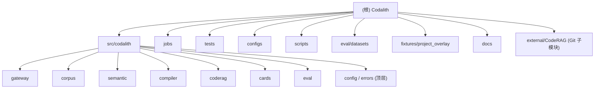

# Codalith — AI 上下文索引（根级）

> 本文件由 AI 上下文初始化流程生成，2026-07-01 21:12:11。仓库此前无任何 CLAUDE.md，全部为新建。
> 阅读顺序：先读本文件了解全局，再按需进入各模块目录的 `CLAUDE.md`。

## 变更记录 (Changelog)

| 时间 | 动作 | 说明 |
| --- | --- | --- |
| 2026-07-06 | 评估规范 | 合并 UE50 基础集与 UE5.7 高频 30 题为统一 UE Eval Suite，并规定检索/编译/MCP 逻辑变更必须自动跑 eval。 |
| 2026-07-01 21:12:11 | 初始化 | 首次为 Codalith 生成根级 + 12 个模块级 CLAUDE.md（含 src/codalith 顶层包与 11 个子模块/顶层目录），并写入 `.claude/index.json`。 |

## 项目愿景

Codalith 是一个面向 **Unreal Engine（UE）源码上下文**的 Python MCP（Model Context Protocol）网关。它在 CodeRAG 风格检索之上封装了：

- **UE 感知语料注册表**：版本化引擎语料 + 项目 overlay，支持 `${VAR:-default}` 占位符。
- **源码读取策略**：`ue://` / `ue-project://` URI 解析、有界行范围、deny/sensitive 策略、速率限制、JSONL 审计。
- **语义提取与语义图**：Build.cs 模块依赖、UHT 反射、C++ 符号、编译守卫、生成代码关系，存入 SQLite 语义图。
- **上下文编译器**：意图检测 + 实体检测 + 检索规划 + 重排 + 证据选择 + 高置信源定位器，产出版本锚定的 Context Pack。
- **知识卡片**：seed 卡片生成、源哈希校验、Markdown 渲染、验证器。
- **评估工具**：`file_recall@5`、`candidate_file_recall`、`module_accuracy`、`latency_p95`，配套 UE50 基础集与 UE5.7 高频 30 题。

对外通过两种传输暴露：

- `codalith-mcp`（stdio，JSON-RPC）
- `codalith-mcp-http`（Streamable HTTP，支持 Claude Code / Codex / VS Code / Cursor 等 MCP 客户端）

主要工具为 `codalith_context`，另有 `codalith_read_source`、`codalith_lookup_symbol`、`codalith_graph`、`codalith_examples`、`codalith_compare_versions`、`codalith_index_status`。

## 架构总览

分层（自底向上）：

1. **配置与错误层**（`codalith.config`, `codalith.errors`）：JSON 兼容 YAML 加载 + 环境变量占位符展开；统一异常体系。
2. **语料层**（`codalith.corpus`）：`CorpusRegistry`（engine + project）、`URIResolver`（`ue://` / `ue-project://`）、`SourcePolicy` + `SourceReadRateLimiter`。
3. **检索适配层**（`codalith.coderag`）：`CodeRAGAdapter`，原生 CodeRAG 与本地确定性兜底双模式。
4. **语义层**（`codalith.semantic`）：SQLite 语义图 + 8 个提取器，对外通过 `query_graph` 做 BFS 邻域查询。
5. **编译层**（`codalith.compiler`）：`ContextCompiler` 编排意图/实体/规划/重排/证据/源定位，输出 `ContextPack`。
6. **卡片层**（`codalith.cards`）：seed 卡片 schema、生成、哈希、渲染、验证。
7. **网关层**（`codalith.gateway`）：MCP stdio + Streamable HTTP，工具/资源/提示/审计/鉴权注册。
8. **任务层**（`jobs/`）：CLI 入口，对应 `pyproject.toml` 的 `codalith-*` 脚本。
9. **评估层**（`codalith.eval`）：指标 + 运行器，数据集位于 `eval/datasets/ue50.jsonl` 与 `eval/datasets/ue57_common_issues_30.jsonl`。

数据流（一次 `codalith_context` 调用）：

```
query -> ContextCompiler.compile
  -> registry.resolve(version, project)
  -> detect_intent / detect_identifiers / detect_modules
  -> locate_source_priors (确定性高置信源先验)
  -> plan_queries -> adapter.search_code (CodeRAG 或本地)
  -> rerank -> select_source_spans
  -> semantic graph edges (可选)
  -> ContextPack (as_dict 返回给 MCP 客户端)
```

## 模块结构图



## 模块索引

| 模块 | 路径 | 一句话职责 | 文档 |
| --- | --- | --- | --- |
| codalith（顶层包） | `src/codalith/` | 包入口、`config.py`（YAML+占位符）、`errors.py`（异常基类） | [doc](./src/codalith/CLAUDE.md) |
| gateway | `src/codalith/gateway/` | MCP stdio + Streamable HTTP 网关、工具/资源/提示/审计/鉴权 | [doc](./src/codalith/gateway/CLAUDE.md) |
| corpus | `src/codalith/corpus/` | 版本化语料注册表、URI 解析、源码读取策略与限流 | [doc](./src/codalith/corpus/CLAUDE.md) |
| semantic | `src/codalith/semantic/` | SQLite 语义图 + UE 提取器（Build.cs / UHT / C++ / 守卫等） | [doc](./src/codalith/semantic/CLAUDE.md) |
| compiler | `src/codalith/compiler/` | 上下文编译器：意图/实体/规划/重排/证据/源定位 → ContextPack | [doc](./src/codalith/compiler/CLAUDE.md) |
| coderag | `src/codalith/coderag/` | CodeRAG 适配器（原生 + 本地兜底）、查询构建、结果映射 | [doc](./src/codalith/coderag/CLAUDE.md) |
| cards | `src/codalith/cards/` | 知识卡片 schema、生成、哈希、Markdown 渲染、验证 | [doc](./src/codalith/cards/CLAUDE.md) |
| eval | `src/codalith/eval/` | 评估指标（recall/module_accuracy/latency）与运行器 | [doc](./src/codalith/eval/CLAUDE.md) |
| jobs | `jobs/` | CLI 任务脚本，对应 `codalith-*` 入口脚本 | [doc](./jobs/CLAUDE.md) |
| tests | `tests/` | pytest 测试套件，含 `ue_acceptance` marker | [doc](./tests/CLAUDE.md) |
| configs | `configs/` | `corpus_registry.yaml` / `mcp_server.yaml` / `source_policy.yaml` | [doc](./configs/CLAUDE.md) |
| scripts | `scripts/` | MCP 客户端一键安装脚本（sh / ps1） | [doc](./scripts/CLAUDE.md) |
| eval/datasets | `eval/datasets/` | UE Eval Suite：`ue50.jsonl` + `ue57_common_issues_30.jsonl` | （并入 eval，无独立文档） |
| fixtures/project_overlay | `fixtures/project_overlay/` | 测试夹具：示例 UE 项目 ProjectA | （并入 tests，无独立文档） |
| docs | `docs/` | 设计文档 `Codalith_CodeRAG_Design.md` | （无独立文档） |
| external/CodeRAG | `external/CodeRAG/` | **Git 子模块，外部依赖，勿深入生成模块文档** | — |

## 运行与开发

### 环境要求

- Python 3.11+
- uv（本地 Python 工作流）
- Docker Compose（容器化验证）
- Git 子模块（pinned CodeRAG checkout）

### 克隆（含子模块）

```bash
git clone --recurse-submodules <repo-url>
# 已有 checkout：
git submodule update --init --recursive external/CodeRAG
```

### 本地运行

```bash
cp .env.example .env
uv sync --extra dev
uv run codalith-mcp                                   # stdio
uv run codalith-mcp-http --host 127.0.0.1 --port 8765 --endpoint /mcp
```

HTTP 端点：`http://127.0.0.1:8765/mcp`

### Docker 工作流

```bash
docker compose run --rm test                                  # 默认检查
docker compose --profile ue run --rm ue-acceptance            # UE 源码冒烟（需挂载）
docker compose --profile coderag run --rm coderag-acceptance  # CodeRAG fake provider
docker compose --profile coderag run --rm coderag-openai-acceptance  # OpenAI-compatible provider
```

### 配置路径

所有主机相关路径通过 `.env` 配置（勿直接改 `docker-compose.yml`）。关键变量见 `.env.example`：

- 主机路径：`CODALITH_ENGINE_HOST_ROOT`、`CODALITH_ENGINE_SOURCE_HOST_ROOT`、`CODALITH_GAMEPLAY_ABILITIES_HOST_ROOT`
- 容器路径：`CODALITH_ENGINE_SOURCE_ROOT`、`CODALITH_ENGINE_INDEXED_ROOT`、`CODALITH_CODERAG_STORE_DIR`、`CODALITH_CODERAG_OPENAI_STORE_DIR`
- 运行时：`CODALITH_AUDIT_LOG`、`CODALITH_SEMANTIC_DB`、`CODALITH_SCOPES`、`CODALITH_HTTP_*`
- CodeRAG：`CODALITH_CODERAG_PROVIDER`、`CODALITH_CODERAG_EMBEDDING_MODEL`、`CODALITH_CODERAG_MAX_CHUNK_CHARS`

`configs/*.yaml` 支持 `${VAR:-default}` 占位符，同一仓库可在不同机器运行而无需改提交的配置文件。

### 入口脚本（pyproject.toml）

| 脚本 | 入口 |
| --- | --- |
| `codalith-mcp` | `codalith.gateway.mcp_server:main` |
| `codalith-mcp-http` | `codalith.gateway.http_server:main` |
| `codalith-eval` | `codalith.eval.runner:main` |
| `codalith-generate-cards` | `jobs.generate_cards:main` |
| `codalith-verify-cards` | `jobs.verify_cards:main` |
| `codalith-index-engine` | `jobs.index_engine:main` |
| `codalith-extract-semantic` | `jobs.extract_semantic:main` |
| `codalith-coderag-acceptance` | `jobs.coderag_acceptance:main` |
| `codalith-run-eval` | `jobs.run_eval:main` |

## 测试策略

- 测试框架：pytest，`addopts = "-q"`，`pythonpath = ["src", "."]`，`testpaths = ["tests"]`。
- `norecursedirs`：`external`、`.venv`、`build`、`dist`。
- marker：`ue_acceptance`（需挂载真实 UE 源码树的可选测试）。
- 共享夹具：`tests/conftest.py` 提供 `fake_engine_root`、`registry_path`、`policy_path`、`registry`、`adapter`、`tools`。
- 验证命令：
  ```bash
  uv run pytest
  uv run ruff check src tests jobs
  uv run mypy src
  ```

### UE Eval Suite 与自动触发规则

Codalith 的 UE 检索质量基线由两个数据集共同定义，任何结论都以自动指标为准，不用人工印象替代：

| 数据集 | 目的 | 判定口径 |
| --- | --- | --- |
| `eval/datasets/ue50.jsonl` | 基础 UE 源码召回、模块识别、核心 API/宏/模块问题覆盖。 | `file_recall@5 == 1.0` 且 `module_accuracy == 1.0`。 |
| `eval/datasets/ue57_common_issues_30.jsonl` | UE5.7 高频开发问题端到端 MCP 召回，包含 GC、构造/组件、UHT/UBT、Tick、Spawn、Timer、Trace、复制/RPC、GAS、Enhanced Input、软引用加载等问题。 | `source_spans[:5]` 覆盖每题 `expected_files`，期望模块全部命中，30/30 必须 `pass`。 |

以下改动会影响逻辑性或查询结果，完成后必须自动跑 UE Eval Suite：

- `src/codalith/compiler/`：意图识别、实体检测、检索规划、source prior、source locator、重排、证据选择、Context Pack 编译。
- `src/codalith/coderag/` 或 `external/CodeRAG/`：查询构造、chunking、embedding、FTS/vector/hybrid 检索、结果映射、score 处理。
- `src/codalith/gateway/`：`codalith_context` 参数、MCP transport、structuredContent、tool schema、会影响工具输出的网关逻辑。
- `src/codalith/semantic/`：语义图抽取、模块/符号/反射关系、Build.cs/UHT/C++ 解析。
- `configs/`、`docker-compose.yml`、`.env.example`：语料路径、Engine 版本、CodeRAG store、MCP endpoint、provider、embedding model 等会改变召回行为的配置。
- `eval/datasets/`、`src/codalith/eval/`、`tests/test_*eval*.py`：评估数据、指标、runner、判定口径。

最小本地验证命令：

```bash
uv run pytest tests/test_cards_eval.py tests/test_mcp_eval_runner.py tests/test_ue57_common_issue_benchmark.py
uv run python -m codalith.eval.runner --dataset eval/datasets/ue50.jsonl --output-dir reports/eval/ue50 --version 5.7.4
```

如果本地或目标环境的 Streamable HTTP MCP 已启动，还必须跑真实 MCP endpoint：

```bash
uv run python -m codalith.eval.mcp_runner --endpoint http://127.0.0.1:8765/mcp --dataset eval/datasets/ue57_common_issues_30.jsonl --output-dir reports/local-mcp-eval --label local_ue57_common_issues --version 5.7.4 --max-source-spans 5 --metric-k 5 --timeout-seconds 90
```

通过标准：

- UE50：`file_recall@5` / `module_accuracy` 均为 `1.000`。
- UE5.7 30 题：`count == 30`，`failure_class` 全部为 `pass`，`file_recall@5 == 1.000`，`candidate_file_recall == 1.000`，`module_accuracy == 1.000`。
- 报告写入 `reports/`，该目录为生成产物，不提交。
- 如果 eval 失败，先修复本次变更引入的问题；若确认是无关既有失败，最终回复必须列出失败项、命令、指标和原因，不得声称通过。

## 编码规范

- **语言/版本**：Python 3.11+，`from __future__ import annotations` 普遍使用。
- **类型**：mypy `strict`（`src`），`tests`/`jobs` 放宽 `disallow_untyped_defs`。
- **ruff**：`line-length=100`，`target=py311`，`select=[E,F,I,B,UP]`，`ignore=[E501]`。
- **数据类**：广泛使用 `@dataclass(frozen=True, slots=True)`。
- **风格**：模块级 docstring 用英文；注释解释“为什么”。
- **路径**：源码包 `src/codalith/`，jobs 顶层包 `jobs/`，包发现 `where=["src","."]`、`include=["codalith*","jobs*"]`。

## AI 使用指引

- 回答任何 UE/UE5 源码级问题时，**优先调用 `codalith_context`**（见 gateway 的 `INSTRUCTIONS`）。
- 读取源码必须走 `codalith_read_source`，它强制有界行范围 + 策略 + 审计；不要绕过。
- `codalith_context` 返回的 Context Pack 要求版本锚定 + 源引用，遵循 `answer_policy`（`must_cite_source`、`do_not_answer_from_memory`）。
- 修改语料/策略时改 `configs/*.yaml` + `.env`，不要硬编码路径。
- 语义图数据需先运行 `codalith-extract-semantic --semantic-db <path>`，否则 `codalith_graph` 会返回空边并提示。
- external/CodeRAG 是外部子模块，不要在其内生成文档或修改源码。

## 安全边界（本索引任务）

- 仅生成/更新文档与 `.claude/index.json`，不修改任何源代码。
- 忽略 `.venv/`、`external/CodeRAG/`（子模块）、`.git/`、`build/`、`reports/`、`data/`、二进制与缓存。
- external/CodeRAG 仅在根索引标注为外部依赖，不深入生成模块文档。
